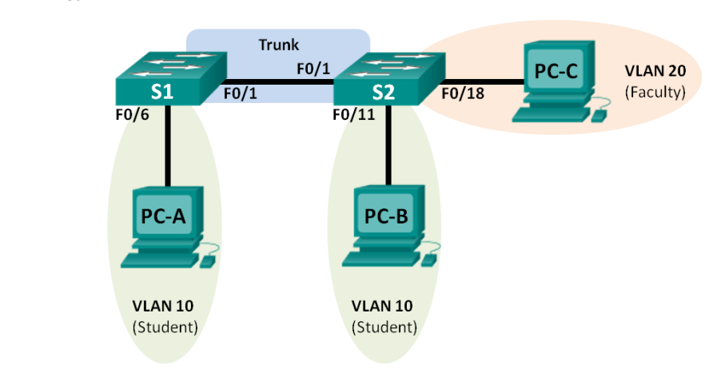

# Lab: Network Segmentation

## Overview

By designing a network to control how traffic flows among its parts, we can achieve network segmentation. Benefits of segmentation include improvements to operational performance, reduction of cyber attack surface, additional protection for vulnerable devices, and a reduction in scope of regulatory compliance. Today you will practice designing a network to achieve a specified segmentation requirement.

## Scenario

Modern switches use virtual local-area networks (VLANs) to improve network performance by separating large Layer 2 broadcast domains into smaller ones. VLANs can also be used as a security measure by controlling which hosts can communicate. In general, VLANs make it easier to design a network to support the goals of an organization.

VLAN trunks are used to span VLANs across multiple devices. Trunks allow the traffic from multiple VLANS to travel over a single link, while keeping the VLAN identification and segmentation intact.

In this lab, you will create VLANs on both switches in the topology, assign VLANs to switch access ports, verify that VLANs are working as expected, and then create a VLAN trunk between the two switches to allow hosts in the same VLAN to communicate through the trunk, regardless of which switch the host is actually attached to.

## Resources

- Download Cisco Packet Tracer for your OS from [Cisco Networking Academy](https://skillsforall.com/resources/lab-downloads){:target="_blank"}
  - This will require you to create an account for Cisco Networking Academy
- [Subnetting Implementation in Cisco Packet Tracer](https://www.geeksforgeeks.org/subnetting-implementation-in-cisco-packet-tracer/){:target="_blank"}
- [What is VLAN?](https://www.guru99.com/vlan-definition-types-advantages.html#9){:target="_blank"}
- [Configuring VLANs and Trunking](https://sites.radford.edu/~hlee3/classes/backup/itec451_spring2017/Cisco/CCNA2_RSE_spring2017/Lab%20Source%20Files_solutions/6.2.2.5%20Lab%20-%20Configuring%20VLANs%20and%20Trunking%20-%20solution.pdf){:target="_blank"}
- [Basic VLAN Configuration](https://courses.cs.ut.ee/2012/NT/juh/3_1.pdf){:target="_blank"}

## Objectives

- Part 1: Build the network and configure basic device settings.
- Part 2: Create VLANs and assign switch ports to the appropriate VLAN.
- Part 3: Configure an 802.1Q trunk between the switches.
- Part 4: Delete the VLAN database.

**Addressing Table**

| Device | Interface | IP Address | Subnet Mask | Default Gateway |
|------- |-----------|------------|-------------|-----------------|
|S1      |VLAN 1     |192.168.1.11|255.255.255.0|N/A              |
|S2      |VLAN 2     |192.168.1.12|255.255.255.0|N/A              |
|PC-A    |NIC        |192.168.10.3|255.255.255.0|192.168.10.1     |
|PC-B    |NIC        |192.168.10.4|255.255.255.0|192.168.10.1     |
|PC-C    |NIC        |192.168.20.3|255.255.255.0|192.168.20.1     |

## Tasks

### Part 1: Build the network and configure basic device settings.

Setup the network topology and configure basic settings on the PC hosts and switches.

- Deploy the following devices in Packet Tracer:
  - 2 Cisco 2960 switches
  - 3 PCs

- Attach the devices as shown in the topology diagram.
- Initialize the switches as necessary.
- Configure PC hosts:
  - Refer to the IP addressing table for host address information.
    - **Note**: If you try to ping from PC-A to PC-B at this point it will **not** work

### Part 2: Create VLANs and assign switch ports.

Create a student and a faculty VLAN on the appropriate switch and assign the VLANs to the appropriate interfaces

- Create VLANs on the switches (S1 and S2).
  - On S1 create the student VLAN (VLAN 10)
  - On S2 create both the student (VLAN 10) and the faculty VLAN (VLAN 20)
- Assign VLANs to the correct switch interfaces.
  - Assign PC-A to the student VLAN.
  - Use the topology to assign VLANs to the appropriate ports on S2.

### Part 3: Configure an 802.1Q Trunk between the switches.

Configure an interface to use Dynamic Trunk Protocol (DTP) so it can negotiate the trunk mode.

- Use DTP to initiate trunking on F0/1.
  - Set F0/1 on S1 and S2 to negotiate trunk mode
  - Verify that VLAN traffic is traveling over trunk interface F0/1.
- Manually configure trunk interface F0/1.
  - Change the switchport mode on interface F0/1 to trunking. Make sure to do this on both switches.

## Stretch Goals

- Introduce a router to the topology and configure inter-VLAN routing so that PC-A and PC-B can ping PC-C.

## Submission Instructions

1. Create a new blank Google Doc. Include above assignment submission text and images within this Google Doc.
1. Name the document according to your course code and assignment.
   - i.e. `seattle-ops-201d1: Reading 01` or `seattle-ops-201d1: Lab 04`.
1. Add your name & date at the top of the Google Doc.
1. Share your Google Doc so that "Anyone with the link can view".
1. Paste the link to your Google Doc in the discussion field below and share an observation from your experience in this lab.
