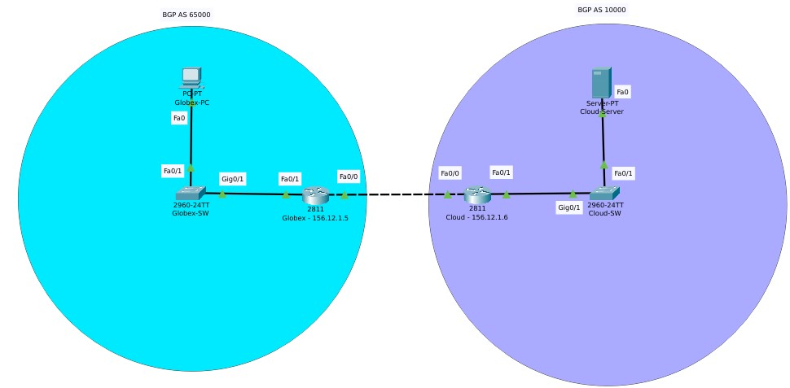

# Lab: Routing

## Overview

Routing is a fundamental mechanic in the overall operations of not only networks but the internet at large. In today's lab you'll practice configuring BGP on two routers.

## Scenario

GlobeX needs to optimize its network traffic with its cloud infrastructure. You've been tasked with configuring BGP routing between the on-prem and cloud routers.

## Objectives

- Download the latest version of Cisco Packet Tracer (link can be found in the resources section below)
  - You will need to create an account and enroll in the "Getting Started with Cisco Packet Tracer" course to gain access to the download
- In packet tracer, configure BGP between two ***2811*** model routers
- For each router on your network, capture the routing table and configurations of the routing protocols
- Update your network topology diagram

## Resources

- [Cisco Packet Tracer](https://skillsforall.com/course/getting-started-cisco-packet-tracer){:target="_blank"}
- [Packet Tracer - BGP Configuration](https://www.packettracernetwork.com/tutorials/bgp.html#:~:text=BGP%20in%20Packet%20Tracer,network%20policies%20and%2For%20rulesets.){:target="_blank"}
- [Cisco IOS IP Routing: RIP Command Reference](https://www.cisco.com/c/en/us/td/docs/ios/iproute_rip/command/reference/irr_book/irr_rip.html){:target="_blank"}
- [Static Routing Configuration](https://www.computernetworkingnotes.com/ccna-study-guide/static-routing-configuration-guide-with-examples.html){:target="_blank"}

## Tasks

### Part 1: Staging

- Deploy two ***2811*** model routers in Packet Tracer
  - Create a link between the two routers
  - Globex Edge Router
    - Interface FastEthernet0/0: BGP Link with IP address 156.12.1.5/30 
    - Interface FastEthernet0/1: Globex internal network with network address 192.168.100.0/24 and gateway of 192.168.100.1
  - Cloud Edge Router
    - Interface FastEthernet0/0: BGP Link with IP address 156.12.1.6/30
    - Interface FastEthernet0/1: Cloud hosted network with network address 192.168.200.0/24 and gateway of 192.168.200.1
- Each network should contain one ***2960*** model switch and at least one host
- Here is an example of what the network topology should look like:

    

### Part 2: Configure BGP Routing
- On the Globex router apply the following settings:
  - Enable BGP
  - Apply the following BGP configuration settings
    - Use private AS values
    - Set cloud router as a BGP neighbor
    - Share the LAN to the neighboring router using BGP
  - Capture screenshots of the data-populated screenshots of the FRR Status page including:
    - BGP Routes
    - BGP Summary
    - BGP Neighbors
- On the cloud router apply the following settings:
  - Enable BGP
  - Apply the following BGP configuration settings
    - Use private AS values
    - Set Globex router as a BGP neighbor
    - Share the LAN to the neighboring router using BGP
  - Capture screenshots of the data-populated screenshots of the router configurations:
    - BGP Routes
    - BGP Summary
    - BGP Neighbors

### Part 3: Routing Tables

- Locate and capture screenshots of the routing tables for:
  - Globex Router
    - Globex PC
  - Cloud Router
    - Cloud-hosted PC
- Capture screenshots of successful pings from the Globex PC to the cloud-hosted PC. Submit this as part of the assignment.

### Part 4: Topology

- Update your network topology on draw.io including IP and network addresses. Submit it as part of this assignment.

## Stretch Goals (Optional Objectives)

- Configure dynamic routing using either RIP or OSPF instead of BGP

## Submission Instructions

1. Create a new blank Google Doc. Include above assignment submission text and images within this Google Doc.
1. Name the document according to your course code and assignment.
   - i.e. `seattle-ops-201d1: Reading 01` or `seattle-ops-201d1: Lab 04`.
1. Add your name & date at the top of the Google Doc.
1. Share your Google Doc so that "Anyone with the link can view".
1. Paste the link to your Google Doc in the discussion field below and share an observation from your experience in this lab.
