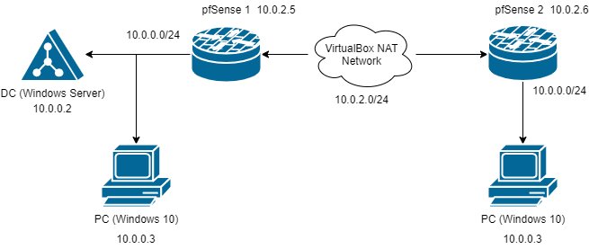

# Lab: VPN Tunnel

## Overview

The VPN protocol can be used in several ways; everyday computer users are likely familiar with client VPN services that claim to grant privacy to their customers. Another way to use VPN is to establish a private network connection between two computers (client-server VPN). Today you'll join two separate networks using IPsec Site-to-Site VPN Tunnelling via pfSense's built-in IPsec tunnelling capabilities.

## Scenario

GlobeX needs to establish LAN network connectivity between two sites in order to share mission-critical resources. Both sites have VPN-capable edge routers.

## Resources

- [Configuring a Site-to-Site IPsec VPN](https://docs.netgate.com/pfsense/en/latest/recipes/ipsec-s2s-psk.html){:target="_blank"}
- [Troubleshooting IPsec VPNs](https://docs.netgate.com/pfsense/en/latest/troubleshooting/ipsec.html){:target="_blank"}

## Objectives

- Join two separate LANs using a VPN tunnel
  - Use pfSense's NAT Network mode to simulate an over-internet connection
- Successfully ping from one pfSense to a host within the subnet of the remote pfSense
- Depict this in a topology diagram

## Tasks

### Part 1: Staging two networks

For this lab, you'll need to deploy a second pfSense VM if you have not done so already.

- The first network should include:
  - pfSense 1
  - Windows 10
- The second network should include:
  - pfSense 2
  - Any VM with a web browser (Windows 10, Kali, etc.)
- The below diagram is an example of how one's design might turn out:

### Part 2: Configuring pfSense

Next, prepare both pfSense devices to handle the VPN connection.

*Include screenshots of each option you configure.*

> Hint: in System > General Setup, under webConfigurator, you can change the "Theme" of the web GUI of one pfSense, to make differentiating between your screenshots easier.

Disable the default blocking of Private Networks and Bogon Networks to allow pfSense routers to respond to pings on the WAN:

- Navigate to Interfaces > WAN, and scroll to the bottom
- Uncheck the boxes for "Block private networks and loopback addresses" and "Block bogon networks"

Set logging to verbose so you can see more information about the tunnel's various handshakes. The steps are:

- Navigate to VPN > IPsec, then select then Advanced Settings tab
- Set IKE SA, IKE Child SA, and Configuration Backend to Diag
- Set all other log settings to Control
- Click Save

VPN tunnel specifications:

**Phase 1**

- Protocol: IKEv2
- Interface: WAN
- Remote Gateway: the WAN IPv4 address of the other router
- Method: Mutual PSK (Preshared Key)
- Encryption: AES 256-bit
- Lifetime: 28800 sec

**Phase 2**

- Mode: Tunnel IPv4
- Local Network: LAN subnet
- Remote Network: the the *subnet address* of the LAN on the other router
  > This is a subnet address address, e.g. 10.0.2.0/24, which is different from a gateway address such as 10.0.2.1
- Protocol: ESP
- Encryption: AES256-GCM
- PFS Key Group: 14 (2048 bit)
- Lifetime: 3600 sec

Firewall Rule specification:
- Create corresponding rules on WAN and IPsec:
  - Action: Pass
  - Protocol: Any
  - Source: Any
  - Destrination: Any

Attempt to verify connectivity:

- Navigate to Status > IPsec
- Press "Connect P1 and P2"
- The status screen should indicate "Established" for P1 and "Installed" for P2 

To troubleshoot connectivity, analyze the IPsec logs for clues as to what may be holding back connectivity from succeeding. Use search engines and reference the Netgate forums for help in evaluating where any misconfigurations could be.

Attempt to ping a host that's on the remote pfSense's internal subnet:

- Navigate to Diagnostics > Ping
- Hostname: the LAN IPv4 address of the other router
- Source Address: LAN

If you've correctly shared your subnets in Phase 2, and allowed ICMP traffic in your various firewall rules, you should be able to see the other subnet. If not, tinker with your configuration some more.

Include a screenshot of your VPN configuration screen and validate successful connectivity by analyzing pfSense status indicators and system logs. Include screenshots that indicate successful VPN tunnel connectivity.

> Don't worry about getting your assets in each LAN to ping over the tunnel just yet; we'll get to that in the next lab.

### Part 3: Topology

Update your topology diagram and clearly indicate the IPs and network addresses of your assets, similar to the diagram above. Submit your lab's topology.

> Leave your VirtualBox network as-is! You'll need it for next class, so don't delete anything (especially that VPN tunnel)!

## Stretch goals (Optional Objectives)

## Submission Instructions

1. Create a new blank Google Doc. Include above assignment submission text and images within this Google Doc.
1. Name the document according to your course code and assignment.
   - i.e. `seattle-ops-201d1: Lab 04`.
1. Add your name & date at the top of the Google Doc.
1. Share your Google Doc so that "Anyone with the link can comment".
1. Paste the link to your Google Doc in the discussion field below and share an observation from your experience in this lab.
